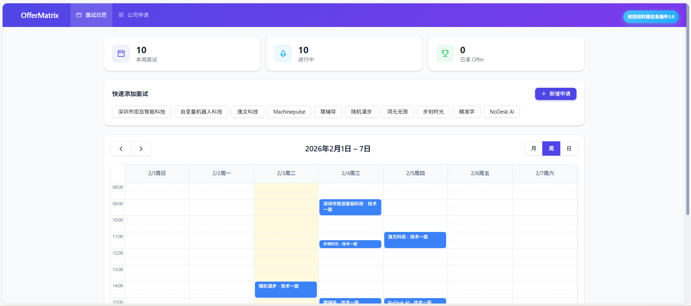
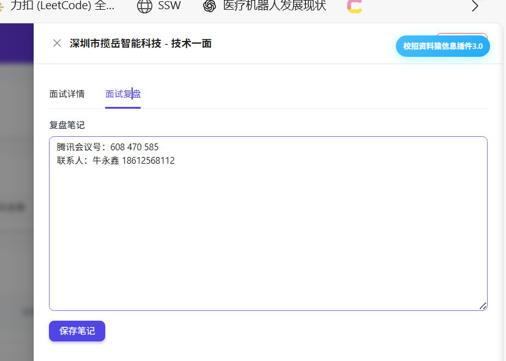

# OfferMatrix - 面试管理系统

一个帮助你管理求职面试流程的 Web 应用。

核心价值：**宏观时间视图（周历）+ 微观流程视图（公司时间线和复盘）**

## 截图预览

### 登录页面


### 面试日历


### 公司申请列表


### 面试详情


### 面试复盘


## 功能特性

- 📅 **面试日历** - 可视化周历展示所有面试安排，支持拖拽调整时间
- 🏢 **公司申请管理** - 追踪每个公司的申请状态（进行中/已拿Offer/已拒绝）
- 📝 **面试详情** - 记录面试轮次、时间、会议链接等信息
- 📖 **面试复盘** - 记录面试问题和反思笔记
- 🔐 **用户认证** - 支持注册登录

## 技术栈

- **前端**: React + Vite + TypeScript + Tailwind CSS + Ant Design + FullCalendar
- **后端**: Go + Gin + GORM + JWT
- **数据库**: MySQL
- **部署**: Docker + Docker Compose

## 快速开始（Docker 部署）

### 1. 克隆项目

```bash
git clone https://github.com/Rebornbugkiller/OfferMatrix.git
cd OfferMatrix
```

### 2. 配置文件

```bash
# 复制配置文件模板
cp backend/config.docker.example.yaml backend/config.docker.yaml

# 编辑配置文件，设置数据库密码和 JWT 密钥
```

### 3. 启动服务

```bash
# 设置 MySQL 密码环境变量
export MYSQL_ROOT_PASSWORD=your_password

# 启动所有服务
docker-compose up -d --build
```

### 4. 访问应用

- 前端：http://localhost
- 后端 API：http://localhost:8080

## 本地开发

### 1. 数据库配置

确保 MySQL 已安装并运行，创建数据库：

```sql
CREATE DATABASE offermatrix;
```

### 2. 启动后端

```bash
cd backend
cp config.example.yaml config.yaml
# 编辑 config.yaml 设置你的 MySQL 密码
go run cmd/server/main.go
```

后端将在 http://localhost:8080 启动。

### 3. 启动前端

```bash
cd frontend
npm install
npm run dev
```

前端将在 http://localhost:5173 启动。

## 项目结构

```
OfferMatrix/
├── backend/                    # Go 后端
│   ├── cmd/server/main.go     # 入口文件
│   ├── internal/
│   │   ├── config/            # 配置管理
│   │   ├── handler/           # API 处理器
│   │   ├── model/             # 数据模型
│   │   ├── repository/        # 数据访问层
│   │   └── middleware/        # JWT 中间件
│   └── pkg/
│       ├── database/          # 数据库连接
│       └── jwt/               # JWT 工具
│
├── frontend/                   # React 前端
│   └── src/
│       ├── components/        # 组件
│       ├── contexts/          # React Context
│       ├── pages/             # 页面
│       ├── services/          # API 服务
│       └── types/             # 类型定义
│
├── docs/images/               # 截图
└── docker-compose.yml         # Docker 编排
```

## License

MIT
