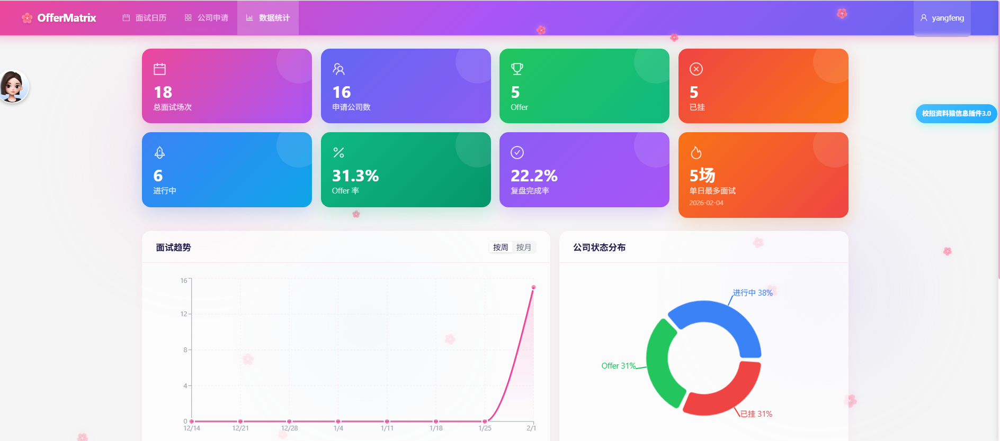

# OfferMatrix

> 求职季的你，是不是也曾在 Excel 里疯狂记录面试时间，然后还是忘了明天有场面试？

**OfferMatrix** 是一个面试管理神器，让你告别混乱的求职流程。

## 为什么需要它？

面试季的痛点：
- 面了 10 家公司，哪家进行到哪一轮了？🤯
- 明天几点面试来着？会议链接呢？😱
- 上次那道算法题怎么答的？下次还会挂... 😭
- 面了这么多，到底 Offer 率多少？📊

**OfferMatrix 帮你搞定这一切：**

✅ **一眼看清本周所有面试** - 周历视图，再也不会撞车

✅ **追踪每家公司进度** - 进行中 / Offer / 挂了，状态一目了然

✅ **面试复盘** - 记录问题和反思，同样的坑不踩两次

✅ **数据统计** - Offer 率、面试趋势、轮次分布，用数据复盘求职季

## 截图

| 面试日历 | 公司列表 |
|---------|---------|
|  |  |

| 面试详情 | 面试复盘 |
|---------|---------|
|  |  |

| 数据统计 |
|---------|
|  |

## 功能亮点

### 📅 可视化周历
- 拖拽调整面试时间，比 Google Calendar 更专注
- 智能颜色标记：待面试蓝色、过期橙色、Offer 绿色、挂了红色

### 🏢 公司申请管理
- 追踪每家公司的申请状态和面试进度
- 快速添加面试，一键为进行中的公司安排下一轮
- 状态标记：进行中 / 已拿 Offer / 已挂

### 📝 面试复盘
- 记录每场面试的问题和你的回答
- 写下反思，下次不再踩同样的坑

### 📊 数据统计
- **核心指标**：总面试数、Offer 率、复盘完成率
- **趋势分析**：按周/月查看面试数量变化
- **分布图表**：公司状态分布、面试轮次分布
- **有趣数据**：单日最多面试记录 🔥

## 技术栈

```
前端: React + TypeScript + Vite + Ant Design + FullCalendar + Recharts
后端: Go + Gin + GORM + JWT
数据库: MySQL
部署: Docker Compose 一键启动
```

## 快速开始

```bash
# 克隆项目
git clone https://github.com/Rebornbugkiller/OfferMatrix.git
cd OfferMatrix

# 配置
cp backend/config.docker.example.yaml backend/config.docker.yaml
# 编辑 config.docker.yaml 设置密码

# 启动（需要 Docker）
export MYSQL_ROOT_PASSWORD=your_password
docker-compose up -d --build

# 访问 http://localhost 开始使用
```

## 本地开发

<details>
<summary>点击展开</summary>

### 数据库
```sql
CREATE DATABASE offermatrix;
```

### 后端
```bash
cd backend
cp config.example.yaml config.yaml
go run cmd/server/main.go
# 运行在 http://localhost:8080
```

### 前端
```bash
cd frontend
npm install
npm run dev
# 运行在 http://localhost:5173
```

</details>

## 项目结构

```
OfferMatrix/
├── backend/                 # Go 后端
│   ├── cmd/server/         # 入口
│   └── internal/           # 业务逻辑（handler/model/repository）
├── frontend/               # React 前端
│   └── src/
│       ├── components/     # 可复用组件
│       ├── pages/          # 页面（Dashboard/Applications/Statistics）
│       └── services/       # API 封装
└── docker-compose.yml      # 一键部署
```

## Roadmap

- [x] 面试日历（周历视图 + 拖拽）
- [x] 公司申请管理
- [x] 面试复盘
- [x] 数据统计
- [ ] 面试提醒（邮件/微信通知）
- [ ] 导出面试记录（PDF/Excel）
- [ ] 多用户协作

## License

MIT

---

**祝你 Offer 拿到手软！** 🎉
